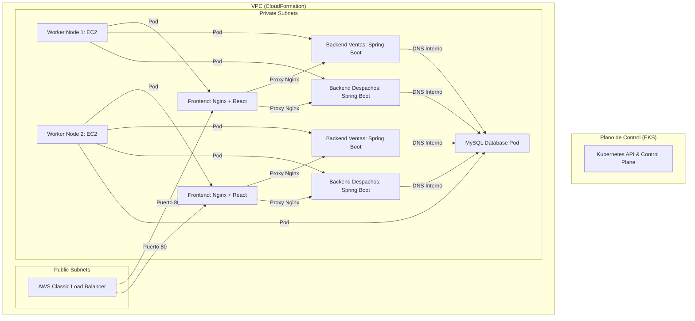

# Proyecto Innovatech — Orquestación y Despliegue en Amazon EKS 🚀

Este repositorio contiene la solución completa de orquestación y automatización de despliegue en la nube para el sistema **Innovatech**, implementado en **Amazon EKS (Elastic Kubernetes Service)** para la Evaluación Parcial N°3 de *Introducción a Herramientas DevOps*.

---

## 🏗️ Arquitectura de la Solución

El sistema sigue una arquitectura de microservicios contenerizados y orquestados bajo el siguiente esquema en AWS:



### Componentes Clave
1.  **Red Base (VPC):** Creada mediante AWS CloudFormation ([vpc.yaml](file:///c:/Users/krosa/Desktop/kubernet/vpc.yaml)). Cuenta con subredes públicas y privadas distribuidas en dos Zonas de Disponibilidad (AZ), equipadas con NAT Gateways para la comunicación segura y privada de los nodos.
2.  **Base de Datos (MySQL):** Corriendo en un pod dedicado de Kubernetes expuesto internamente en el puerto `3306` (nombre DNS: `innovatech-db`). Se inicializa con los scripts de la carpeta `./db` para la persistencia.
3.  **Backends (Java/Spring Boot):** 
    *   **Ventas:** Expuesto internamente en el puerto `8080` (nombre DNS: `innovatech-ventas-backend`).
    *   **Despachos:** Expuesto internamente en el puerto `8081` (nombre DNS: `innovatech-despachos-backend`).
4.  **Frontend (React/Vite + Nginx):** Expuesto públicamente mediante un balanceador de carga público (ELB) de AWS (puerto `80`). Nginx actúa como proxy inverso para redirigir las llamadas `/api/v1/ventas` y `/api/v1/despachos` a sus respectivos microservicios sin exponerlos a internet.

---

## ⚙️ Configuración y Despliegue en EKS

### Requisitos Previos
*   AWS CLI configurado con acceso al laboratorio.
*   `kubectl` instalado localmente.
*   Docker Desktop activo.

### 1. Conectar terminal local a EKS
```powershell
aws eks update-kubeconfig --region us-east-1 --name mi-cluster-eks
```

### 2. Desplegar servicios en Kubernetes
El archivo [k8s-deployment.yaml](file:///c:/Users/krosa/Desktop/kubernet/Innovatech_Vidal_Monsalve_Soto/k8s-deployment.yaml) contiene la definición completa de los recursos (Deployments, Services y Load Balancer). Se aplica ejecutando:
```powershell
kubectl apply -f k8s-deployment.yaml
```

### 3. Verificar estado
```powershell
# Obtener estado de los pods
kubectl get pods

# Obtener URL del Load Balancer público del Frontend
kubectl get service innovatech-frontend-service
```

---

## 📈 Autoescalado Horizontal (HPA)

Para garantizar la alta disponibilidad y la tolerancia a fallos del backend de ventas, se ha configurado un **Horizontal Pod Autoscaler (HPA)** mediante el archivo `hpa.yaml`:

*   **Métrica de control:** Uso de CPU.
*   **Umbral:** 50% de uso de CPU promedio.
*   **Límites de réplicas:** Mínimo 2 pods, máximo 5 pods.
*   **Requisito:** Requiere que el clúster disponga de **Metrics Server** (ejecutar `kubectl apply -f https://github.com/kubernetes-sigs/metrics-server/releases/latest/download/components.yaml` si no está presente).

Aplicar HPA:
```powershell
kubectl apply -f hpa.yaml
```

---

## 🔄 Pipeline de Integración y Despliegue Continuo (CI/CD)

El repositorio incluye pipelines automatizados utilizando **GitHub Actions** en la ruta `.github/workflows/`:

*   **`cicd-tienda-db.yml`**: Compila, sube a ECR y reinicia la base de datos MySQL en EKS cuando hay cambios en la carpeta `/db`.
*   **`cicd-tienda-backend.yml`**: Compila, sube a ECR y reinicia los microservicios de Ventas y Despachos en EKS cuando hay cambios en la carpeta `/backend`.
*   **`cicd-tienda-frontend.yml`**: Compila, sube a ECR y despliega el Frontend en EKS cuando hay cambios en la carpeta `/frontend`.

### Secretos requeridos en GitHub
Para el correcto funcionamiento del pipeline, debes configurar las siguientes variables en los secretos de tu repositorio:
*   `AWS_ACCESS_KEY_ID`: ID de clave de acceso temporal de AWS.
*   `AWS_SECRET_ACCESS_KEY`: Clave de acceso secreta temporal de AWS.
*   `AWS_SESSION_TOKEN`: Token de sesión de AWS Academy (debe actualizarse al iniciar cada sesión del laboratorio).
*   `AWS_REGION`: `us-east-1`.

---

## 🪵 Monitoreo, Logs y Validación

### Obtener logs de contenedores
Para diagnosticar o auditar el funcionamiento de los microservicios:
```powershell
# Logs del backend de ventas
kubectl logs -l app=innovatech-ventas --tail=100

# Logs del backend de despachos
kubectl logs -l app=innovatech-despachos --tail=100

# Logs de base de datos
kubectl logs -l app=innovatech-db --tail=100
```

### Alta disponibilidad y recuperación
Si un pod falla, Kubernetes lo detecta automáticamente mediante sus políticas de reinicio y levanta una nueva réplica idéntica en segundos. Esto se puede comprobar eliminando un pod manualmente:
```powershell
kubectl delete pod <nombre-del-pod>
# Kubernetes creará un reemplazo de inmediato.
```
